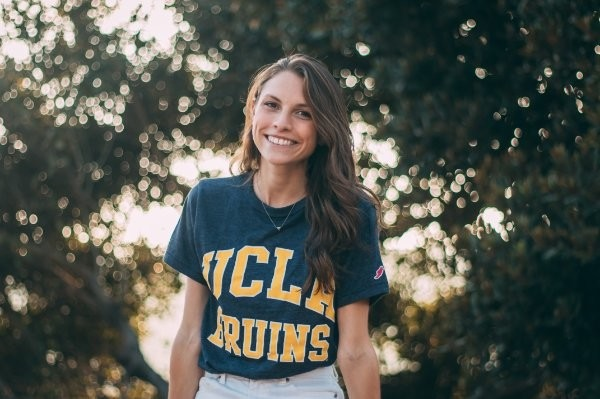

```{r setup, include=FALSE}
knitr::opts_chunk$set(echo = TRUE)
```
<center></center>

<br>  
  
### About Me

I am currently finishing my Master's degree at the Bren School of Environmental Science and Management, while also working as an Ocean Health Index Fellow for the National Center of Ecological Synthesis and Analysis.
<br>
In my free time, I love to surf, swim and do art.

<br>


<style>
  .col2 {
    columns: 2 200px;         /* number of columns and width in pixels*/
    -webkit-columns: 2 200px; /* chrome, safari */
    -moz-columns: 2 200px;    /* firefox */
  }
</style>
 

<div class="col2">
**Research interests**

- Conservation of wild land and seascapes
- Sustainable food systems
- Data science
<br>
<br>

**Skills**

- RStudio
- Spatial Analysis
- Spanish
<br>
<br>

</div>
<br>

### Coming soon: A Cool Map
<br>

**A map of Hawaiian Land Use created for grauduate data analysis course**


